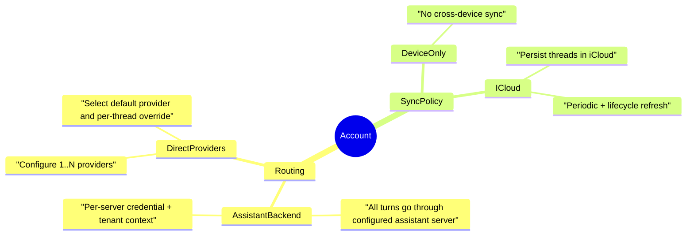

# Account Model

This document defines the target account model for the native app.

It reflects three product rules:

1. If a user connects an Assistant backend, every conversation is routed through that backend.
2. Assistant-backed accounts default to iCloud conversation sync (`enabled = true`) and refresh regularly across devices.
3. If a user does not use an Assistant backend, they can configure one-to-many model providers and can optionally enable iCloud sync.

## Target mental model

Separate account concerns into two independent axes:

- **Routing**: where inference runs (Assistant backend vs direct provider).
- **Sync**: where conversation state is persisted/synchronized (device-only vs iCloud).

`routing` and `sync` should not be encoded as a single enum value.



## Target schema

```swift
struct AssistantAccount: Identifiable, Hashable, Codable {
    let id: UUID
    var displayName: String
    var userHandle: String
    var createdAt: Date

    var routing: Routing
    var syncPolicy: SyncPolicy
}

extension AssistantAccount {
    enum Routing: Hashable, Codable {
        case assistantBackend(AssistantBackendConfig)
        case directProviders(DirectProvidersConfig)
    }

    struct AssistantBackendConfig: Hashable, Codable {
        var server: ServerEnvironment
        var credentialRef: CredentialRef
        var tenantID: String?
    }

    struct DirectProvidersConfig: Hashable, Codable {
        var providers: [ProviderProfile] // 1..N
        var defaultProviderID: ProviderProfile.ID
    }

    struct ProviderProfile: Identifiable, Hashable, Codable {
        let id: UUID
        var provider: ModelProvider
        var auth: ProviderAuth
        var label: String
        var isEnabled: Bool
    }

    enum SyncPolicy: Hashable, Codable {
        case deviceOnly
        case iCloud(ICloudSyncConfig)
    }

    struct ICloudSyncConfig: Hashable, Codable {
        var isEnabled: Bool
        var refreshIntervalSeconds: Int // e.g. 60
        var refreshOnForeground: Bool
        var refreshOnThreadOpen: Bool
    }
}
```

### Defaults

- **Assistant backend routing**: `syncPolicy = .iCloud(.init(isEnabled: true, refreshIntervalSeconds: 60, refreshOnForeground: true, refreshOnThreadOpen: true))`
- **Direct provider routing**: `syncPolicy = .deviceOnly` by default, with opt-in iCloud in account settings.

## Runtime behavior

- **AssistantBackend routing**
  - `AgentLoop` always chooses the backend service.
  - Local thread store is a cache for fast rendering/offline fallback; backend remains source of truth for turns.
  - When iCloud is enabled, the cache is shared across Apple devices and refreshed periodically.
- **DirectProviders routing**
  - `AgentLoop` routes to selected provider profile.
  - Threads are local-first data; optional iCloud sync mirrors thread state.
- **Sync refresh**
  - Trigger on app foreground.
  - Trigger when opening a thread.
  - Trigger periodically while app is active (timer using `refreshIntervalSeconds`).

## Mapping from current model

Current model uses:

- `accountType` (`remote`, `localDevice`, `localICloud`)
- `remoteProvider`
- `remoteAuthMode`

Map to target as follows:

| Current shape               | Target routing                                                | Target sync                            |
| --------------------------- | ------------------------------------------------------------- | -------------------------------------- |
| `remote + assistantBackend` | `.assistantBackend(...)`                                      | `.iCloud(enabled: true)`               |
| `remote + openAI`           | `.directProviders([openAIProfile])`                           | `.deviceOnly` (user can enable iCloud) |
| `localDevice`               | `.directProviders([])` placeholder until first provider added | `.deviceOnly`                          |
| `localICloud`               | `.directProviders([])` placeholder until first provider added | `.iCloud(enabled: true)`               |

## Migration plan

1. **Introduce new types (non-breaking)**
   - Add `routing` and `syncPolicy` with decoding fallbacks from legacy fields.
   - Keep legacy fields for one release as compatibility shims.
2. **Update routing decisions**
   - Replace `accountType` / `remoteProvider` branches in `AgentLoop` with `routing`.
3. **Update persistence and settings UI**
   - Replace "Storage type" account creation with explicit "Routing" and "Sync" controls.
   - Add direct-provider profile management (add/remove/select default).
4. **Implement periodic refresh hooks**
   - Add foreground + timer refresh coordinator for iCloud-enabled accounts.
5. **Remove legacy fields**
   - Drop `accountType`, `remoteProvider`, `remoteAuthMode` only after migration telemetry validates decode + save cycles.

## Notes for implementation

- Keep credentials in Keychain and persist only credential references in account snapshots.
- Ensure all account shapes surface the same `ChatThread` API so UI stays account-agnostic.
- If iCloud is unavailable at runtime, degrade to device-only persistence and surface a non-blocking warning.
